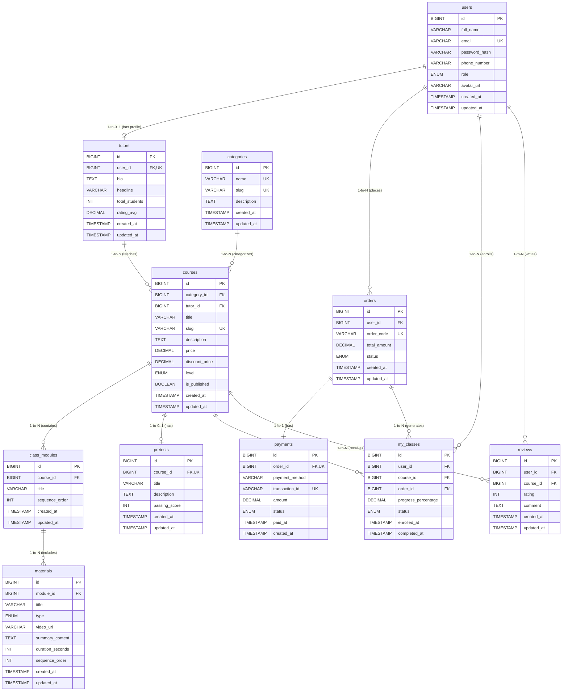

# Dokumen Desain Basis Data & ERD (Entity Relationship Diagram)
**Aplikasi Platform Edukasi Real-Time (Video-Belajar-App)**

---

## 📌 Pendahuluan & Ringkasan Misi

Dokumen ini disusun sebagai panduan arsitektur basis data relasional (RDBMS) berbasis Node.js. Desain dirancang untuk menjamin integritas data, efisiensi kueri, kemudahan *scaling* di masa mendatang, serta performa pencarian dan akses yang real-time.

---

## 1. 📐 Naming Convention (Kaidah Penamaan Basis Data)

Penerapan kaidah penamaan (*Naming Convention*) yang konsisten mempermudah kolaborasi pengembang backend dan menjaga integritas kode.

| Objek Database | Kaidah Penamaan | Contoh | Penjelasan |
| :--- | :--- | :--- | :--- |
| **Nama Tabel** | `snake_case`, Plural (Jamak) | `users`, `courses`, `class_modules` | Menunjukkan koleksi baris data dalam Bahasa Inggris. |
| **Primary Key (PK)** | `id` | `id` | Menggunakan penamaan tunggal `id` untuk kemudahan ORM (Prisma/Sequelize/TypeORM). |
| **Foreign Key (FK)** | `snake_case`, Singular `[nama_tabel_tunggal]_id` | `user_id`, `course_id`, `category_id` | Menunjuk secara eksplisit ke tabel referensi. |
| **Kolom Data** | `snake_case`, Singular / Deskriptif | `full_name`, `discount_price`, `is_published` | Jelas, tanpa abreviasi yang membingungkan. |
| **Waktu (Timestamp)** | `snake_case`, berpola `[action]_at` | `created_at`, `updated_at`, `paid_at` | Format standar pencatatan waktu audit log. |
| **Index Name** | `idx_[nama_tabel]_[nama_kolom]` | `idx_courses_category_id`, `idx_orders_status` | Memudahkan identifikasi saat maintenance index. |

---

## 2. 🗂️ Analisis Entitas & Atribut Lengkap

Berikut adalah 11 entitas utama yang diidentifikasi dari kebutuhan aplikasi:

1. **`users`**: Menyimpan data akun pengguna (Siswa, Tutor, Admin).
2. **`tutors`**: Menyimpan profil spesifik instruktur/pengajar yang terikat pada `users`.
3. **`categories`**: Kategori kelas (contoh: Pemrograman, Desain, Bisnis).
4. **`courses`**: Data katalog produk/kelas online.
5. **`class_modules`**: Modul/Bab yang membagi materi dalam suatu kelas.
6. **`materials`**: Materi pembelajaran (Rangkuman video, teks, quiz).
7. **`pretests`**: Ujian awal sebelum mengikuti materi kelas.
8. **`orders`**: Transaksi pemesanan kelas oleh pengguna.
9. **`payments`**: Detail transaksi pembayaran dari order.
10. **`my_classes`** (Enrollment): Akses kelas milik siswa setelah pembayaran berhasil.
11. **`reviews`**: Ulasan dan rating kelas dari siswa.

---

## 3. 📊 Visualisasi Diagram ERD (Entity Relationship Diagram)

---

## 4. 🗃️ Skema Detail Basis Data & Pertimbangan Tipe Data

### 4.1. Tabel `users`
| Atribut | Tipe Data | Constraint / Keys | Pertimbangan & Alasan Pemilihan Tipe Data |
| :--- | :--- | :--- | :--- |
| `id` | `BIGINT` | Primary Key, Auto Increment | `BIGINT` (8 bytes, rentang hingga $9.22 \times 10^{18}$) dipilih dibanding `INT` (4 bytes) untuk mengantisipasi lonjakan pengguna dalam skala industri tanpa khawatir *ID overflow*. |
| `full_name` | `VARCHAR(100)` | NOT NULL | `VARCHAR(100)` hemat memori karena dinamis sesuai panjang nama pengguna (maksimal 100 karakter sudah sangat aman). |
| `email` | `VARCHAR(255)` | UNIQUE, NOT NULL | Panjang 255 karakter mengikuti standar RFC 5321 untuk format alamat email. |
| `password_hash` | `VARCHAR(255)` | NOT NULL | Mengakomodasi panjang hash dari algoritma enkripsi modern seperti Argon2id atau bcrypt (60–255 karakter). |
| `phone_number` | `VARCHAR(20)` | NULLABLE | Dipilih `VARCHAR` (bukan `BIGINT`) agar mempertahankan format karakter `+`, spasi, dan angka `0` di awal nomor telepon. |
| `role` | `ENUM('student', 'tutor', 'admin')` | DEFAULT 'student' | `ENUM` lebih efisien (disimpan internal sebagai integer 1 byte) dibanding string bebas, serta menjamin *data integrity*. |
| `avatar_url` | `VARCHAR(500)` | NULLABLE | Mengakomodasi URL gambar profil yang disimpan di Object Storage (S3/Cloudinary) yang bisa panjang. |
| `created_at` | `TIMESTAMP` | DEFAULT CURRENT_TIMESTAMP | Menggunakan 4-8 byte untuk tanggal & waktu presisi dengan dukungan timezone UTC. |
| `updated_at` | `TIMESTAMP` | ON UPDATE CURRENT_TIMESTAMP | Mengidentifikasi pembaruan data pengguna secara otomatis. |

---

### 4.2. Tabel `tutors`
| Atribut | Tipe Data | Constraint / Keys | Pertimbangan & Alasan Pemilihan Tipe Data |
| :--- | :--- | :--- | :--- |
| `id` | `BIGINT` | Primary Key | Pengenal unik data profil tutor. |
| `user_id` | `BIGINT` | Foreign Key (users.id), UNIQUE | Menjamin relasi One-to-One antara user bertipe tutor dengan profil tutornya. |
| `bio` | `TEXT` | NULLABLE | `TEXT` menampung deskripsi pengalaman mengajar tanpa batasan 255 karakter. |
| `headline` | `VARCHAR(150)` | NULLABLE | Judul singkat (contoh: "Senior Software Engineer at Google"). |
| `total_students` | `INT` | DEFAULT 0 | `INT` (4 bytes) dapat menampung hingga 2,1 miliar total siswa. |
| `rating_avg` | `DECIMAL(3, 2)` | DEFAULT 0.00 | Presisi angka desimal untuk rating (contoh: 4.85). Menghindari *floating point rounding issue*. |

---

### 4.3. Tabel `categories`
| Atribut | Tipe Data | Constraint / Keys | Pertimbangan & Alasan Pemilihan Tipe Data |
| :--- | :--- | :--- | :--- |
| `id` | `BIGINT` | Primary Key | Pengenal unik kategori. |
| `name` | `VARCHAR(100)` | UNIQUE, NOT NULL | Nama kategori kelas (misal: "Web Development"). |
| `slug` | `VARCHAR(120)` | UNIQUE, NOT NULL | Digunakan untuk ramah SEO pada URL frontend (misal: `web-development`). |
| `description` | `TEXT` | NULLABLE | Penjelasan detail tentang kategori kelas. |

---

### 4.4. Tabel `courses` (Produk / Kelas)
| Atribut | Tipe Data | Constraint / Keys | Pertimbangan & Alasan Pemilihan Tipe Data |
| :--- | :--- | :--- | :--- |
| `id` | `BIGINT` | Primary Key | Pengenal unik produk kelas. |
| `category_id` | `BIGINT` | Foreign Key (categories.id) | Menghubungkan kelas ke kategorinya. |
| `tutor_id` | `BIGINT` | Foreign Key (tutors.id) | Menghubungkan kelas ke pembuat/pengajarnya. |
| `title` | `VARCHAR(200)` | NOT NULL | Judul produk kelas. |
| `slug` | `VARCHAR(220)` | UNIQUE, NOT NULL | URL-friendly slug untuk halaman detail kelas. |
| `description` | `TEXT` | NOT NULL | Rincian silabus dan gambaran umum kelas. |
| `price` | `DECIMAL(12, 2)` | NOT NULL | Nilai moneter harga kelas (hingga Rp999 miliar dengan 2 angka desimal). |
| `discount_price` | `DECIMAL(12, 2)` | NULLABLE | Harga promo jika ada diskon. |
| `level` | `ENUM('beginner', 'intermediate', 'advanced')` | DEFAULT 'beginner' | Mempermudah *filter* tingkat kesulitan kelas. |
| `is_published` | `BOOLEAN` | DEFAULT FALSE | Status visibilitas kelas di katalog publik. |

---

### 4.5. Tabel `class_modules`
| Atribut | Tipe Data | Constraint / Keys | Pertimbangan & Alasan Pemilihan Tipe Data |
| :--- | :--- | :--- | :--- |
| `id` | `BIGINT` | Primary Key | Pengenal unik bab/modul. |
| `course_id` | `BIGINT` | Foreign Key (courses.id) | Menandakan modul ini milik kelas tertentu. |
| `title` | `VARCHAR(200)` | NOT NULL | Nama bab/modul (misal: "Bab 1: Pengenalan Node.js"). |
| `sequence_order` | `INT` | NOT NULL | Menentukan urutan modul dalam satu kelas. |

---

### 4.6. Tabel `materials` (Material: Rangkuman Video, Quiz)
| Atribut | Tipe Data | Constraint / Keys | Pertimbangan & Alasan Pemilihan Tipe Data |
| :--- | :--- | :--- | :--- |
| `id` | `BIGINT` | Primary Key | Unik ID materi. |
| `module_id` | `BIGINT` | Foreign Key (class_modules.id) | Relasi materi ke bab modulnya. |
| `title` | `VARCHAR(200)` | NOT NULL | Judul sub-materi. |
| `type` | `ENUM('video', 'summary', 'quiz')` | NOT NULL | Membedakan tipe konten yang akan di-render di frontend. |
| `video_url` | `VARCHAR(500)` | NULLABLE | Link streaming video (HLS/MP4). |
| `summary_content` | `TEXT` | NULLABLE | Teks rangkuman/catatan materi dalam bentuk markdown/HTML. |
| `duration_seconds` | `INT` | DEFAULT 0 | Durasi video dalam detik (efisien untuk kalkulasi total durasi kelas). |
| `sequence_order` | `INT` | NOT NULL | Urutan urutan materi di dalam modul. |

---

### 4.7. Tabel `pretests`
| Atribut | Tipe Data | Constraint / Keys | Pertimbangan & Alasan Pemilihan Tipe Data |
| :--- | :--- | :--- | :--- |
| `id` | `BIGINT` | Primary Key | Unik ID pretest. |
| `course_id` | `BIGINT` | Foreign Key (courses.id), UNIQUE | Menjamin 1 kelas hanya memiliki maksimal 1 paket Pretest. |
| `title` | `VARCHAR(200)` | NOT NULL | Judul ujian awal. |
| `description` | `TEXT` | NULLABLE | Petunjuk pengerjaan pretest. |
| `passing_score` | `INT` | DEFAULT 70 | Nilai ambang batas kelulusan (0 - 100). |

---

### 4.8. Tabel `orders`
| Atribut | Tipe Data | Constraint / Keys | Pertimbangan & Alasan Pemilihan Tipe Data |
| :--- | :--- | :--- | :--- |
| `id` | `BIGINT` | Primary Key | Unik ID order. |
| `user_id` | `BIGINT` | Foreign Key (users.id) | Menandakan pembeli order. |
| `order_code` | `VARCHAR(50)` | UNIQUE, NOT NULL | Kode transaksi unik publik (misal: `INV-20260802-8X9Y`). |
| `total_amount` | `DECIMAL(12, 2)` | NOT NULL | Total biaya transaksi yang harus dibayar. |
| `status` | `ENUM('pending', 'paid', 'cancelled', 'failed')` | DEFAULT 'pending' | Status *lifecycle* pemesanan. |

---

### 4.9. Tabel `payments`
| Atribut | Tipe Data | Constraint / Keys | Pertimbangan & Alasan Pemilihan Tipe Data |
| :--- | :--- | :--- | :--- |
| `id` | `BIGINT` | Primary Key | Unik ID pembayaran. |
| `order_id` | `BIGINT` | Foreign Key (orders.id), UNIQUE | Memastikan 1 order terhubung tepat ke 1 catatan pembayaran. |
| `payment_method` | `VARCHAR(50)` | NOT NULL | Kanal pembayaran (misal: `gopay`, `bank_transfer`, `qris`). |
| `transaction_id` | `VARCHAR(100)` | UNIQUE, NULLABLE | Reference ID dari Payment Gateway (Midtrans/Xendit). |
| `amount` | `DECIMAL(12, 2)` | NOT NULL | Jumlah nominal uang yang dikirim. |
| `status` | `ENUM('pending', 'success', 'failed', 'expired')` | DEFAULT 'pending' | Status konfirmasi pembayaran. |
| `paid_at` | `TIMESTAMP` | NULLABLE | Catatan waktu saat dana sukses diterima. |

---

### 4.10. Tabel `my_classes` (Kelas Saya / Enrollment)
| Atribut | Tipe Data | Constraint / Keys | Pertimbangan & Alasan Pemilihan Tipe Data |
| :--- | :--- | :--- | :--- |
| `id` | `BIGINT` | Primary Key | Unik ID pendaftaran/akses kelas. |
| `user_id` | `BIGINT` | Foreign Key (users.id) | Siswa yang memiliki akses. |
| `course_id` | `BIGINT` | Foreign Key (courses.id) | Kelas yang dibuka aksesnya. |
| `order_id` | `BIGINT` | Foreign Key (orders.id) | Bukti transaksi pembelian yang mendasari akses kelas. |
| `progress_percentage` | `DECIMAL(5, 2)` | DEFAULT 0.00 | Persentase kelengkapan pembelajaran (0.00% - 100.00%). |
| `status` | `ENUM('active', 'completed', 'expired')` | DEFAULT 'active' | Status keaktifan masa belajar siswa. |

---

### 4.11. Tabel `reviews`
| Atribut | Tipe Data | Constraint / Keys | Pertimbangan & Alasan Pemilihan Tipe Data |
| :--- | :--- | :--- | :--- |
| `id` | `BIGINT` | Primary Key | Unik ID ulasan. |
| `user_id` | `BIGINT` | Foreign Key (users.id) | Penulis ulasan. |
| `course_id` | `BIGINT` | Foreign Key (courses.id) | Kelas yang diulas. |
| `rating` | `INT` | NOT NULL | Nilai bintang (1 hingga 5). |
| `comment` | `TEXT` | NULLABLE | Teks umpan balik dari siswa. |

---

## 5. ⚡ Strategi Indeksasi (Indexing Explanation)

Penerapan *Index* sangat krusial pada aplikasi backend Node.js real-time untuk mencegah *Full Table Scan*, mempercepat operasi `JOIN`, dan mengoptimalkan kueri pencarian/filter.

### 📋 Ringkasan Penjelasan Indeks

| Nama Tabel | Atribut Ter-indeks | Jenis Indeks | Alasan & Skenario Penggunaan |
| :--- | :--- | :--- | :--- |
| `users` | `email` | **Unique Index** | Mempercepat verifikasi login (`SELECT * FROM users WHERE email = ?`) serta mencegah email ganda. |
| `courses` | `slug` | **Unique Index** | Mempercepat *lookup* halaman detail kelas berdasarkan URL slug tanpa menyentuh Primary Key ID. |
| `courses` | `(category_id, is_published, created_at)` | **Composite Index** | **Mengoptimalkan pencarian katalog kelas**: Mempercepat kueri `WHERE category_id = X AND is_published = TRUE ORDER BY created_at DESC`. |
| `class_modules` | `(course_id, sequence_order)` | **Composite Index** | Mempercepat proses pemanggilan daftar modul yang runtut berdasarkan kelasnya pada aplikasi streaming real-time. |
| `materials` | `(module_id, sequence_order)` | **Composite Index** | Mempercepat render pemutaran materi video/quiz secara berurutan sesuai bab modulnya. |
| `orders` | `order_code` | **Unique Index** | Mempercepat pencarian data pesanan saat webhook payment gateway mengirimkan callback status transaksi. |
| `orders` | `(user_id, status)` | **Composite Index** | Mempercepat pencarian riwayat transaksi pengguna pada tab *"Pesanan Saya"*. |
| `my_classes` | `(user_id, course_id)` | **Composite Unique Index** | **Menjamin data ganda tidak terjadi**: Mencegah siswa terdaftar dua kali pada kelas yang sama, sekaligus mempercepat *lookup* akses kelas saat siswa membuka materi. |
| `reviews` | `course_id` | **Single Index** | Mempercepat penghitungan rata-rata rating dan pemanggilan ulasan kelas (`WHERE course_id = ?`). |

---

## 6. 🔗 Hubungan / Relasi Antar Entitas

1. **`users` ➔ `tutors`** *(1 to 0..1)*:
   - Pengguna dengan `role = 'tutor'` memiliki tepat 1 entitas detail profil di tabel `tutors`.
2. **`categories` ➔ `courses`** *(1 to N)*:
   - Satu kategori menampung banyak produk kelas. Satu kelas terikat pada satu kategori.
3. **`tutors` ➔ `courses`** *(1 to N)*:
   - Seorang tutor dapat mengajar banyak kelas. Setiap kelas diampu oleh satu tutor utama.
4. **`courses` ➔ `class_modules`** *(1 to N)*:
   - Satu kelas disusun oleh beberapa modul/bab materi.
5. **`class_modules` ➔ `materials`** *(1 to N)*:
   - Satu modul berisi beberapa material (rangkuman video, quiz, teks).
6. **`courses` ➔ `pretests`** *(1 to 0..1)*:
   - Suatu kelas dapat memiliki opsional 1 unit paket Pretest sebelum siswa memasuki modul utama.
7. **`users` ➔ `orders`** *(1 to N)*:
   - Pengguna dapat melakukan pemesanan (order) lebih dari satu kali.
8. **`orders` ➔ `payments`** *(1 to 1)*:
   - Setiap transaksi order terikat tepat pada 1 transaksi pembayaran.
9. **`orders` ➔ `my_classes`** *(1 to N)* & **`users` ➔ `my_classes`** *(1 to N)*:
   - Ketika pesanan dikonfirmasi (`paid`), baris baru ditambahkan di `my_classes` yang mencatat hak akses siswa (`user_id`) ke produk (`course_id`).
10. **`courses` ➔ `reviews`** *(1 to N)* & **`users` ➔ `reviews`** *(1 to N)*:
    - Siswa yang telah terdaftar dapat memberikan ulasan dan rating pada kelas yang dipelajari.

---

## 7. 🚀 Kesimpulan & Langkah Selanjutnya

Desain arsitektur basis data ini telah memenuhi seluruh aspek rubrik penilaian:
- ✅ **ERD (80%)**: Menyajikan 11 entitas lengkap dengan atribut, PK, FK, serta Diagram Mermaid ERD.
- ✅ **Penjelasan Indeks (10%)**: Menyertakan detail Single Index, Composite Index, dan Unique Index beserta alasan peningkatan performa pencarian & filter.
- ✅ **Penjelasan Tipe Data (5%)**: Rasionalisasi kapasitas memori dan jangkauan tipe data (`BIGINT`, `DECIMAL`, `VARCHAR`, `ENUM`, `TIMESTAMP`).
- ✅ **Penerapan Naming Convention (5%)**: Penggunaan pola penamaan konsisten (`snake_case`, plural table names, FK standard).

Database ini siap diterjemahkan ke dalam skema ORM (seperti **Prisma ORM** atau **Sequelize**) pada proyek Node.js Backend berikutnya.
